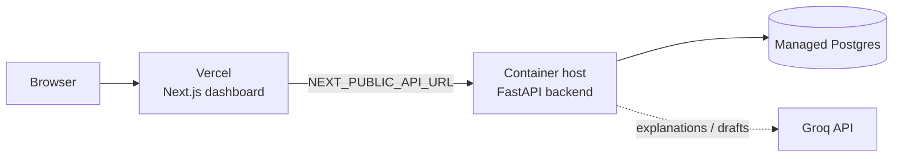

# Deployment Guide

## The honest shape of this deployment

This is a **two-part deployment**, not one:

- The **Next.js frontend** deploys to **Vercel** (which is what Vercel is built for).
- The **Python backend** (FastAPI + SQLAlchemy + ML models + a persistent database) **cannot run on Vercel** — Vercel's serverless model doesn't fit a stateful API with a database connection pool and trained model artifacts. The backend deploys to a **container host** (Render, Railway, or Fly.io) with a managed **Postgres** database.



So: **Vercel hosts the frontend; the backend lives elsewhere.** Don't try to push the FastAPI app to Vercel — it will fight you.

---

## Part 1 — Backend (Render / Railway / Fly.io)

### 1. Switch SQLite → Postgres (one line)

`DATABASE_URL` has been config-driven from the start, so this is a configuration change, not a code change. Provision a managed Postgres (Render/Railway/Neon/Supabase all have free tiers) and set its connection string as `DATABASE_URL`. Create the tables against Postgres on first boot and verify the pipeline runs identically.

### 2. Environment variables

```
DATABASE_URL=postgresql://...        # the managed Postgres
GROQ_API_KEY=...                     # for AML explanations, dispute rebuttals, SAR drafts
GROQ_MODEL=llama-3.1-8b-instant      # config-driven; never the decommissioned llama3-8b-8192
ALLOWED_ORIGINS=https://<your-vercel-app>.vercel.app   # CORS
```

### 3. Model artifacts

The AML ensemble is a trained artifact and should be **gitignored** (regenerated, not committed). On deploy, either run `train` as a release/startup step or ship a pre-trained artifact to the host. Decide and document which.

### 4. Containerize (optional but recommended)

Add a `Dockerfile` for the backend (uv-based) and run it on the host. A `docker-compose.yml` (backend + Postgres) gives a one-command local full stack: `docker compose up`.

### 5. Start command

```bash
uv run uvicorn interface.api:app --host 0.0.0.0 --port $PORT
```

### 6. CORS

Enable CORS for the deployed Vercel origin (`ALLOWED_ORIGINS`). This is the most common reason a deployed dashboard can't reach the backend — don't skip it.

---

## Part 2 — Frontend (Vercel)

1. Import the repo into Vercel and set the **Root Directory** to `frontend/`.
2. Set the environment variable:
   ```
   NEXT_PUBLIC_API_URL=https://<your-backend-host-url>
   ```
   (the deployed backend from Part 1 — **not** localhost).
3. Vercel auto-detects Next.js; build and deploy.
4. Open the Vercel URL and confirm the dashboard loads data from the backend.

---

## Part 3 — Verify end to end

- The deployed dashboard fetches `/findings`, `/stats`, `/graph` from the deployed backend (check the browser network tab; CORS headers present).
- A cold start works (first request after idle).
- `docker compose up` reproduces the full stack locally from a clean clone.

---

## Part 4 — CI (recommended)

Add a GitHub Actions workflow that runs `uv run pytest` on every push/PR. It's cheap, and it catches the class of bug that has hit this repo before (missing committed files, broken tests) **before** they reach `main` or a deploy.

```yaml
# .github/workflows/ci.yml (sketch)
name: CI
on: [push, pull_request]
jobs:
  test:
    runs-on: ubuntu-latest
    steps:
      - uses: actions/checkout@v4
      - uses: astral-sh/setup-uv@v3
      - run: uv sync
      - run: uv run pytest -q
```

---

## Common pitfalls

- **Pushing the backend to Vercel** — won't work; backend goes to a container host.
- **`NEXT_PUBLIC_API_URL` left as localhost** — the deployed frontend then calls your laptop, not the backend.
- **Missing CORS origin** — deployed dashboard loads but shows no data.
- **Committed model artifacts / logs / DBs** — gitignore them; train on deploy or ship the artifact deliberately.
- **`GROQ_MODEL` set to a decommissioned id** — explanations/drafts silently degrade. Use a current model.
