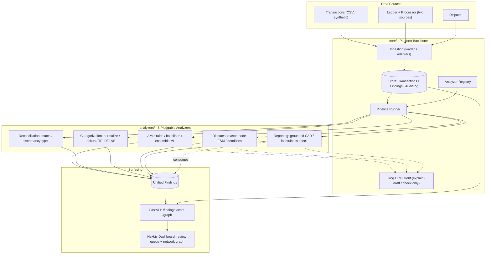
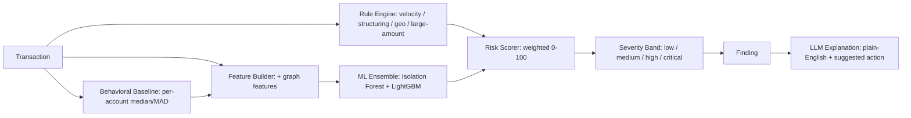

# Transaction Intelligence Platform

A pluggable **transaction-analysis platform** that runs five independent fintech analyzers over the same payment data and surfaces everything they find in one unified review queue.

It is **not** a single fraud tool — it's a platform with a shared backbone (`core/`) and five swappable analyzers (`analyzers/`), each implementing one contract and emitting findings into one place. Adding a sixth analyzer is dropping in a module, not rewiring the system.

## The five analyzers

| Analyzer | What it does | Technique | Evaluation metric |
|---|---|---|---|
| **AML** | Flags fraud + money-laundering patterns (structuring, velocity, geo, large-amount) | Rules + behavioral baselines + ML ensemble (Isolation Forest + LightGBM) + LLM explanations | Precision / Recall / F1 / PR-AUC (imbalanced → no accuracy) |
| **Reconciliation** | Matches two sources (ledger vs. processor) and flags every break | Exact + fuzzy matching, discrepancy typing, LLM break-explanation | Precision / Recall on injected breaks |
| **Categorization** | Classifies each transaction's merchant category / purpose code from messy descriptions | Description normalization → lookup table → TF-IDF + Naive Bayes | Macro-F1 + confusion matrix (balanced → accuracy OK) |
| **Disputes** | Tracks chargeback lifecycle, deadlines, and drafts rebuttals | Reason-code→evidence map + state machine + LLM rebuttal draft | Workflow metrics (win rate, deadline handling) |
| **Reporting** | Auto-drafts SAR narratives from the other analyzers' findings | Grounded LLM generation + faithfulness self-check + human-in-loop | Grounding / completeness (generative → no precision/recall) |

> **Design principle:** detection and matching are **deterministic**; the LLM only **explains, drafts, and checks** — it never decides a transaction is fraud, never resolves a break, and never files a report. Every generated artifact is `pending_review`.

## How it fits together



**Traceability — how any of the five is tracked:** every analyzer writes into the **same `Finding` table** (`analyzer`, `entity_id`, `finding_type`, `score`, `band`, `status`, `summary`, `explanation`, `payload`). So a flagged AML transaction, a reconciliation break, a low-confidence categorization, a dispute nearing its deadline, and a drafted SAR all appear in one queue — filterable by analyzer, severity, and status — each linking back to the evidence that produced it. The `Reporting` analyzer closes the loop by *consuming* other analyzers' findings to draft its narratives.

### AML detection pipeline (the deepest analyzer)



## Tech stack

- **Backend:** Python · FastAPI · Typer (CLI) · SQLAlchemy · pandas · scikit-learn · LightGBM
- **AI:** Groq (Llama 3.1) for explanations/drafts — config-driven model, graceful degradation if absent
- **Frontend:** Next.js 15 · React · TypeScript · Tailwind · a force-directed network graph
- **Data:** seeded synthetic generators (reproducible) + a Kaggle adapter for external validation

## Project structure

```
core/          platform backbone (Analyzer contract, registry, pipeline, store, ingest, llm)
analyzers/     the five analyzers: aml/ reconciliation/ categorization/ disputes/ reporting/
data/          synthetic data generators (transactions, reconciliation, disputes) + Kaggle adapter
interface/     cli.py (Typer) and api.py (FastAPI)
frontend/      Next.js dashboard
tests/         per-analyzer test suites
```

## Quickstart

```bash
# 1. Install (uv)
uv sync

# 2. Generate synthetic data + ingest
uv run python -m interface.cli generate --accounts 50 --days 30 --out data.csv
uv run python -m interface.cli ingest data.csv

# 3. Run an analyzer (aml / reconciliation / categorization / disputes / reporting)
uv run python -m interface.cli run aml

# 4. Train the AML ensemble, then view findings
uv run python -m interface.cli train --labels data.csv
uv run python -m interface.cli findings --band critical

# 5. Regenerate the combined scorecard across all analyzers
uv run python -m interface.cli evaluate
```

### API

```bash
uv run uvicorn interface.api:app --reload
# GET /findings  /findings/top  /findings/{id}  /stats  /accounts/top  /graph  /health
```

### Frontend

```bash
cd frontend
npm install
# set NEXT_PUBLIC_API_URL to the backend (e.g. http://localhost:8000)
npm run dev
```

## Scorecard

Each analyzer is evaluated with the *appropriate* metric for its type (see `SCORECARD.md`, regenerated via `evaluate`):

| Analyzer | Headline result |
|---|---|
| **AML** | ML ensemble lifts recall ~+10pts over rules (~50% -> ~60%), F1 up, geo/structuring/large-amount detected; honest precision tradeoff |
| **Reconciliation** | ~84% recall at 100% precision on injected breaks |
| **Categorization** | Macro-F1 baseline (lightweight TF-IDF + NB; trained on a bootstrap set) |
| **Disputes** | Workflow metrics — win rate, open/closed, deadline tracking |
| **Reporting** | Grounded SAR drafts with a faithfulness check (requires a Groq key to run) |

*All numbers are on synthetic data; the Kaggle adapter provides external validation for AML. Keep this table in sync with `SCORECARD.md` — both come from the same `evaluate` run.*

## Documentation

- [`spec.md`](./spec.md) — technical specification (analyzers, data flow, the `Analyzer` contract, the `Finding` model, evaluation)
- [`AGENTS.md`](./AGENTS.md) — guide for AI agents and contributors (conventions, how to add an analyzer, the disciplines)
- [`CLAUDE.md`](./CLAUDE.md) — Claude-specific quick reference
- [`DEPLOYMENT.md`](./DEPLOYMENT.md) — deploying the frontend (Vercel) and backend (separate host + Postgres)
- [`Roadmap.md`](./Roadmap.md) — phase history
